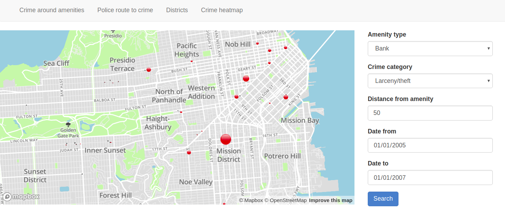
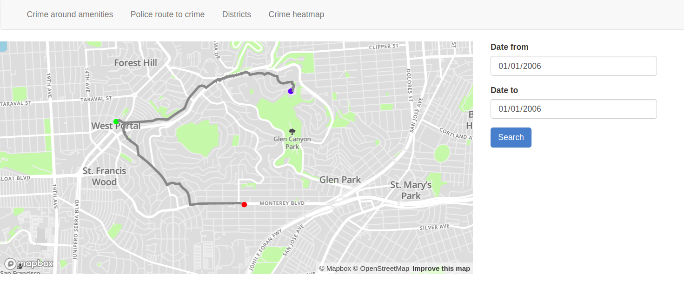
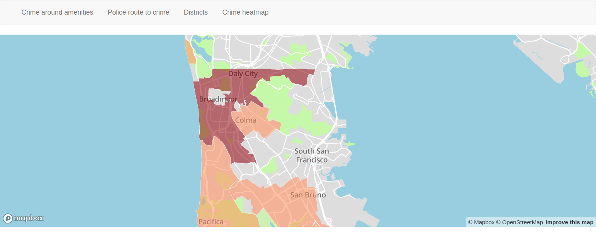
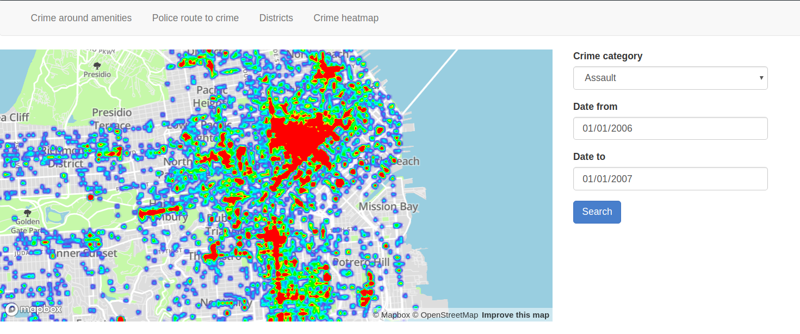

# Overview

This application works with San Francisco police dispatch calls. Most important features are:
- display criminal activity around different types of amenities in San Francisco
- navigate police to crime from nearest police station, with stop in nearest coffee house en route to buy donuts.
- total overview of criminality in city districts
- heatmap of crime in the city

This is it in action:






The application has classic MVC architecture and is built in MVC framework.

## Model
Only few database tables actually have representation in Rails model, and those are the police reports and few associated enums imported from csv from kaggle.
Most of the tables are imported from osm and from pg_routing. Model is very thin, only basic generated classes are present.

## Controller
There single map controller in application, with 4 action, each for one described use case.
It sanitizes and then passes user input into service classes that handle raw SQL queries and converts returned data to geojson
that can be fed to mapbox API.

## View
Consists of 2 parts:
- **html**: simple html container for map and forms for user input
- **coffee**: rubylike compiled to javascript language, that connects to mapboxJS api and feeds it with
geojsons provided by controller.

## Services
Services contain raw sql queries for postgis, and methods that serve geojson for mapbox.
Query optimisation story is written in README.rb

## Data
Data comes from 2 sources:
1. **kaggle** provides police calls reports of crimes and their locations
2. **openstreetmaps** provides polygons for amenities and then points and roads for pg_routing to form a graph for navigation.


# Technicalities
Rails app conatains single controller called `map_controller` with 4 actions, each for single use case.
Mapbox api connection is handled by `app/assets/javascripts/map.coffee`

All database queries are stored in service classes in folder `app/services`. Each use case has own service class.

## Amenities.rb
### Query
```sql
      SELECT ST_AsGeoJSON(poly.way_lat_lon) AS coords,
             poly.name AS poly_name, 
             COUNT(i.*) AS occurences,
             json_agg(i.description) AS descriptions,
             ST_AsGeoJSON(ST_Centroid(poly.way_lat_lon)) AS centroid
      FROM planet_osm_polygon AS poly
      JOIN incidents AS i ON ST_DWithin(poly.way_lat_lon, i.position, #{distance})
      JOIN categories AS cat ON i.category_id = cat.id
      WHERE amenity LIKE '#{type}'
        AND cat.name LIKE '#{crime}'
        AND i.date >= '#{date_from}'
        AND i.date <= '#{date_to}'
      GROUP BY poly.way_lat_lon, poly.name
```
### Explain
```sql
GroupAggregate  (cost=264313.85..264318.88 rows=1 width=346)
  Group Key: poly.way_lat_lon, poly.name
  ->  Sort  (cost=264313.85..264313.85 rows=1 width=410)
        Sort Key: poly.way_lat_lon, poly.name
        ->  Nested Loop  (cost=4650.65..264313.84 rows=1 width=410)
              Join Filter: (((poly.way_lat_lon)::geography && _st_expand(i."position", '50'::double precision)) AND (i."position" && _st_expand((poly.way_lat_lon)::geography, '50'::double precision)) AND _st_dwithin((poly.way_lat_lon)::geography, i."position", '50'::double precision, true))
              ->  Nested Loop  (cost=4650.23..16456.99 rows=3927 width=200)
                    ->  Seq Scan on categories cat  (cost=0.00..1.49 rows=1 width=8)
                          Filter: ((name)::text ~~ 'assault'::text)
                    ->  Bitmap Heap Scan on incidents i  (cost=4650.23..16414.11 rows=4139 width=208)
                          Recheck Cond: ((category_id = cat.id) AND (date >= '2005-01-01'::date) AND (date <= '2006-01-01'::date))
                          ->  BitmapAnd  (cost=4650.23..4650.23 rows=4139 width=0)
                                ->  Bitmap Index Scan on index_incidents_on_category_id  (cost=0.00..1082.67 rows=50433 width=0)
                                      Index Cond: (category_id = cat.id)
                                ->  Bitmap Index Scan on index_incidents_on_date  (cost=0.00..3527.98 rows=153155 width=0)
                                      Index Cond: ((date >= '2005-01-01'::date) AND (date <= '2006-01-01'::date))
              ->  Materialize  (cost=0.42..456.15 rows=120 width=242)
                    ->  Index Scan using polygon_amenities on planet_osm_polygon poly  (cost=0.42..455.55 rows=120 width=242)
                          Index Cond: (amenity = 'bank'::text)
                          Filter: (amenity ~~ 'bank'::text)
```
Query does the sequence scan on categories with a very small price, when filtering by category name. There is no point
in adding index, because names are unique and the table is simple enum, so index would be just a copy of the table. Another
reason is, that optimizing cost of tens, when total price is in thousands is a nonsense. Other joins and conditions are using
bitmap index scans - best case scenario.
 
## CrimeHeatmap.rb
### Query
```sql
      SELECT ST_AsGeoJSON(i.position), pd.name
      FROM incidents AS i
      JOIN categories AS cat ON cat.id = i.category_id
      JOIN police_districts AS pd ON pd.id = i.police_district_id
      WHERE cat.name LIKE '#{crime}'
        AND i.date >= '#{date_from}'
        AND i.date <= '#{date_to}'
```
### Explain
```sql
Hash Join  (cost=4682.05..16508.99 rows=3927 width=64)
  Hash Cond: (i.police_district_id = pd.id)
  ->  Nested Loop  (cost=4650.23..16456.99 rows=3927 width=40)
        ->  Seq Scan on categories cat  (cost=0.00..1.49 rows=1 width=8)
              Filter: ((name)::text ~~ 'assault'::text)
        ->  Bitmap Heap Scan on incidents i  (cost=4650.23..16414.11 rows=4139 width=48)
              Recheck Cond: ((category_id = cat.id) AND (date >= '2005-01-01'::date) AND (date <= '2006-01-01'::date))
              ->  BitmapAnd  (cost=4650.23..4650.23 rows=4139 width=0)
                    ->  Bitmap Index Scan on index_incidents_on_category_id  (cost=0.00..1082.67 rows=50433 width=0)
                          Index Cond: (category_id = cat.id)
                    ->  Bitmap Index Scan on index_incidents_on_date  (cost=0.00..3527.98 rows=153155 width=0)
                          Index Cond: ((date >= '2005-01-01'::date) AND (date <= '2006-01-01'::date))
  ->  Hash  (cost=19.70..19.70 rows=970 width=40)
        ->  Seq Scan on police_districts pd  (cost=0.00..19.70 rows=970 width=40)
```
Again, sequence scan is only done on enum table, otherwise bitmap scans and bitmap ands are used for conditions.

## PolicePath.rb
### Query
This is a complete query as send to the db. In ruby it is much easier to read, due to decoupling to small simple reusable
components. Check file `app/services/police_path.rb`
```sql
SELECT St_asgeojson(St_union(line.the_geom)), 
       String_agg(DISTINCT line.NAME, '<br>') 
FROM   ways AS line, 
  ( 
  SELECT * 
  FROM   pgr_dijkstra( 'SELECT gid AS id, source, target, length AS cost FROM ways',
    ( 
    SELECT   v.id 
    FROM     ways_vertices_pgr AS v 
    ORDER BY v.the_geom <-> 
      ( 
      SELECT   poly.way_lat_lon 
      FROM     planet_osm_polygon AS poly 
      WHERE    amenity LIKE 'police' 
      ORDER BY poly.way_lat_lon <-> 
        ( 
        SELECT   i.position 
        FROM     incidents  AS i 
        JOIN     categories AS cat 
        ON       cat.id = i.category_id
        JOIN     resolutions AS res 
        ON       res.id = i.resolution_id
        WHERE    i.date >= '2005-01-01' 
        AND      i.date <= '2006-01-01' 
        ORDER BY i.position <-> St_geomfromgeojson('{"type":"Point","coordinates":[-122.41605260314408,37.77096502519123]}') limit 1 ) limit 1 ) limit 1 ), 
    ( 
    SELECT   v.id 
    FROM     ways_vertices_pgr AS v 
    ORDER BY v.the_geom <-> 
      ( 
      SELECT   poly.way_lat_lon 
      FROM     planet_osm_polygon AS poly 
      WHERE    amenity LIKE 'cafe' 
      ORDER BY ((poly.way_lat_lon <-> 
        ( 
        SELECT   i.position 
        FROM     incidents  AS i 
        JOIN     categories AS cat 
        ON       cat.id = i.category_id
        JOIN     resolutions AS res 
        ON       res.id = i.resolution_id
        WHERE    i.date >= '2005-01-01' 
        AND      i.date <= '2006-01-01' 
        ORDER BY i.position <-> st_geomfromgeojson('{"type":"Point","coordinates":[-122.41605260314408,37.77096502519123]}') limit 1 )) + (poly.way_lat_lon <-> 
          ( 
          SELECT   poly.way_lat_lon 
          FROM     planet_osm_polygon AS poly
          WHERE    amenity LIKE 'police'
          ORDER BY poly.way_lat_lon <-> 
            ( 
            SELECT   i.position
            FROM     incidents  AS i
            JOIN     categories AS cat
            ON       cat.id = i.category_id
            JOIN     resolutions AS res
            ON       res.id = i.resolution_id
            WHERE    i.date >= '2005-01-01' 
            AND      i.date <= '2006-01-01' 
            ORDER BY i.position <-> st_geomfromgeojson('{"type":"Point","coordinates":[-122.41605260314408,37.77096502519123]}') limit 1 ) limit 1 ))) limit 1 ) limit 1 ), directed := false ) ) AS pc_dji,
  ( 
  SELECT * 
  FROM   pgr_dijkstra( 'SELECT gid AS id, source, target, length AS cost FROM ways',
    ( 
    SELECT   v.id 
    FROM     ways_vertices_pgr AS v 
    ORDER BY v.the_geom <-> 
      ( 
      SELECT   poly.way_lat_lon 
      FROM     planet_osm_polygon AS poly 
      WHERE    amenity LIKE 'cafe' 
      ORDER BY ((poly.way_lat_lon <-> 
        ( 
        SELECT   i.position 
        FROM     incidents  AS i 
        JOIN     categories AS cat 
        ON       cat.id = i.category_id
        JOIN     resolutions AS res 
        ON       res.id = i.resolution_id
        WHERE    i.date >= '2005-01-01' 
        AND      i.date <= '2006-01-01' 
        ORDER BY i.position <-> st_geomfromgeojson('{"type":"Point","coordinates":[-122.41605260314408,37.77096502519123]}') limit 1 )) + (poly.way_lat_lon <-> 
          ( 
          SELECT   poly.way_lat_lon 
          FROM     planet_osm_polygon AS poly
          WHERE    amenity LIKE 'police'
          ORDER BY poly.way_lat_lon <-> 
            ( 
              SELECT   i.position
              FROM     incidents  AS i
              JOIN     categories AS cat
              ON       cat.id = i.category_id
              JOIN     resolutions AS res
              ON       res.id = i.resolution_id
              WHERE    i.date >= '2005-01-01' 
              AND      i.date <= '2006-01-01' 
              ORDER BY i.position <-> st_geomfromgeojson('{"type":"Point","coordinates":[-122.41605260314408,37.77096502519123]}') limit 1 ) limit 1 ))) limit 1 ) limit 1 ), 
          ( 
          SELECT   v.id 
          FROM     ways_vertices_pgr AS v 
          ORDER BY v.the_geom <-> 
            ( 
            SELECT   i.position 
            FROM     incidents  AS i 
            JOIN     categories AS cat 
            ON       cat.id = i.category_id 
            JOIN     resolutions AS res 
            ON       res.id = i.resolution_id 
            WHERE    i.date >= '2005-01-01' 
            AND      i.date <= '2006-01-01' 
            ORDER BY i.position <-> st_geomfromgeojson('{"type":"Point","coordinates":[-122.41605260314408,37.77096502519123]}') limit 1 ) limit 1 ), directed := false ) ) AS cc_dji 
WHERE  line.gid = pc_dji.edge 
OR     line.gid = cc_dji.edge
```
### Explain
```sql
Aggregate  (cost=61257930.72..61257933.23 rows=1 width=64)
  InitPlan 3 (returns $2)
    ->  Limit  (cost=80530.74..80530.84 rows=1 width=16)
          InitPlan 2 (returns $1)
            ->  Limit  (cost=80530.46..80530.46 rows=1 width=230)
                  InitPlan 1 (returns $0)
                    ->  Limit  (cost=80482.33..80482.33 rows=1 width=40)
                          ->  Sort  (cost=80482.33..80865.22 rows=153155 width=40)
                                Sort Key: ((i."position" <-> '0101000020E6100000D9FA189BA09A5EC030C760FBAEE24240'::geography))
                                ->  Hash Join  (cost=3599.97..79716.55 rows=153155 width=40)
                                      Hash Cond: (i.resolution_id = res.id)
                                      ->  Hash Join  (cost=3568.14..40992.19 rows=153155 width=40)
                                            Hash Cond: (i.category_id = cat.id)
                                            ->  Bitmap Heap Scan on incidents i  (cost=3566.27..40544.59 rows=153155 width=48)
                                                  Recheck Cond: ((date >= '2005-01-01'::date) AND (date <= '2006-01-01'::date))
                                                  ->  Bitmap Index Scan on index_incidents_on_date  (cost=0.00..3527.98 rows=153155 width=0)
                                                        Index Cond: ((date >= '2005-01-01'::date) AND (date <= '2006-01-01'::date))
                                            ->  Hash  (cost=1.39..1.39 rows=39 width=8)
                                                  ->  Seq Scan on categories cat  (cost=0.00..1.39 rows=39 width=8)
                                      ->  Hash  (cost=19.70..19.70 rows=970 width=8)
                                            ->  Seq Scan on resolutions res  (cost=0.00..19.70 rows=970 width=8)
                  ->  Sort  (cost=48.13..48.16 rows=11 width=230)
                        Sort Key: (((poly.way_lat_lon)::geography <-> $0))
                        ->  Index Scan using polygon_amenities on planet_osm_polygon poly  (cost=0.42..48.07 rows=11 width=230)
                              Index Cond: (amenity = 'police'::text)
                              Filter: (amenity ~~ 'police'::text)
          ->  Index Scan using ways_vertices_pgr_the_geom_idx on ways_vertices_pgr v  (cost=0.28..7253.70 rows=74271 width=16)
                Order By: (the_geom <-> $1)
  InitPlan 8 (returns $7)
    ->  Limit  (cost=161278.73..161278.82 rows=1 width=16)
          InitPlan 7 (returns $6)
            ->  Limit  (cost=161278.44..161278.45 rows=1 width=230)
                  InitPlan 4 (returns $3)
                    ->  Limit  (cost=80482.33..80482.33 rows=1 width=40)
                          ->  Sort  (cost=80482.33..80865.22 rows=153155 width=40)
                                Sort Key: ((i_1."position" <-> '0101000020E6100000D9FA189BA09A5EC030C760FBAEE24240'::geography))
                                ->  Hash Join  (cost=3599.97..79716.55 rows=153155 width=40)
                                      Hash Cond: (i_1.resolution_id = res_1.id)
                                      ->  Hash Join  (cost=3568.14..40992.19 rows=153155 width=40)
                                            Hash Cond: (i_1.category_id = cat_1.id)
                                            ->  Bitmap Heap Scan on incidents i_1  (cost=3566.27..40544.59 rows=153155 width=48)
                                                  Recheck Cond: ((date >= '2005-01-01'::date) AND (date <= '2006-01-01'::date))
                                                  ->  Bitmap Index Scan on index_incidents_on_date  (cost=0.00..3527.98 rows=153155 width=0)
                                                        Index Cond: ((date >= '2005-01-01'::date) AND (date <= '2006-01-01'::date))
                                            ->  Hash  (cost=1.39..1.39 rows=39 width=8)
                                                  ->  Seq Scan on categories cat_1  (cost=0.00..1.39 rows=39 width=8)
                                      ->  Hash  (cost=19.70..19.70 rows=970 width=8)
                                            ->  Seq Scan on resolutions res_1  (cost=0.00..19.70 rows=970 width=8)
                  InitPlan 6 (returns $5)
                    ->  Limit  (cost=80530.46..80530.46 rows=1 width=230)
                          InitPlan 5 (returns $4)
                            ->  Limit  (cost=80482.33..80482.33 rows=1 width=40)
                                  ->  Sort  (cost=80482.33..80865.22 rows=153155 width=40)
                                        Sort Key: ((i_2."position" <-> '0101000020E6100000D9FA189BA09A5EC030C760FBAEE24240'::geography))
                                        ->  Hash Join  (cost=3599.97..79716.55 rows=153155 width=40)
                                              Hash Cond: (i_2.resolution_id = res_2.id)
                                              ->  Hash Join  (cost=3568.14..40992.19 rows=153155 width=40)
                                                    Hash Cond: (i_2.category_id = cat_2.id)
                                                    ->  Bitmap Heap Scan on incidents i_2  (cost=3566.27..40544.59 rows=153155 width=48)
                                                          Recheck Cond: ((date >= '2005-01-01'::date) AND (date <= '2006-01-01'::date))
                                                          ->  Bitmap Index Scan on index_incidents_on_date  (cost=0.00..3527.98 rows=153155 width=0)
                                                                Index Cond: ((date >= '2005-01-01'::date) AND (date <= '2006-01-01'::date))
                                                    ->  Hash  (cost=1.39..1.39 rows=39 width=8)
                                                          ->  Seq Scan on categories cat_2  (cost=0.00..1.39 rows=39 width=8)
                                              ->  Hash  (cost=19.70..19.70 rows=970 width=8)
                                                    ->  Seq Scan on resolutions res_2  (cost=0.00..19.70 rows=970 width=8)
                          ->  Sort  (cost=48.13..48.16 rows=11 width=230)
                                Sort Key: (((poly_1.way_lat_lon)::geography <-> $4))
                                ->  Index Scan using polygon_amenities on planet_osm_polygon poly_1  (cost=0.42..48.07 rows=11 width=230)
                                      Index Cond: (amenity = 'police'::text)
                                      Filter: (amenity ~~ 'police'::text)
                  ->  Sort  (cost=265.65..265.81 rows=65 width=230)
                        Sort Key: ((((poly_2.way_lat_lon)::geography <-> $3) + (poly_2.way_lat_lon <-> $5)))
                        ->  Index Scan using polygon_amenities on planet_osm_polygon poly_2  (cost=0.42..265.33 rows=65 width=230)
                              Index Cond: (amenity = 'cafe'::text)
                              Filter: (amenity ~~ 'cafe'::text)
          ->  Index Scan using ways_vertices_pgr_the_geom_idx on ways_vertices_pgr v_1  (cost=0.28..7253.70 rows=74271 width=16)
                Order By: (the_geom <-> $6)
  InitPlan 13 (returns $12)
    ->  Limit  (cost=161278.73..161278.82 rows=1 width=16)
          InitPlan 12 (returns $11)
            ->  Limit  (cost=161278.44..161278.45 rows=1 width=230)
                  InitPlan 9 (returns $8)
                    ->  Limit  (cost=80482.33..80482.33 rows=1 width=40)
                          ->  Sort  (cost=80482.33..80865.22 rows=153155 width=40)
                                Sort Key: ((i_3."position" <-> '0101000020E6100000D9FA189BA09A5EC030C760FBAEE24240'::geography))
                                ->  Hash Join  (cost=3599.97..79716.55 rows=153155 width=40)
                                      Hash Cond: (i_3.resolution_id = res_3.id)
                                      ->  Hash Join  (cost=3568.14..40992.19 rows=153155 width=40)
                                            Hash Cond: (i_3.category_id = cat_3.id)
                                            ->  Bitmap Heap Scan on incidents i_3  (cost=3566.27..40544.59 rows=153155 width=48)
                                                  Recheck Cond: ((date >= '2005-01-01'::date) AND (date <= '2006-01-01'::date))
                                                  ->  Bitmap Index Scan on index_incidents_on_date  (cost=0.00..3527.98 rows=153155 width=0)
                                                        Index Cond: ((date >= '2005-01-01'::date) AND (date <= '2006-01-01'::date))
                                            ->  Hash  (cost=1.39..1.39 rows=39 width=8)
                                                  ->  Seq Scan on categories cat_3  (cost=0.00..1.39 rows=39 width=8)
                                      ->  Hash  (cost=19.70..19.70 rows=970 width=8)
                                            ->  Seq Scan on resolutions res_3  (cost=0.00..19.70 rows=970 width=8)
                  InitPlan 11 (returns $10)
                    ->  Limit  (cost=80530.46..80530.46 rows=1 width=230)
                          InitPlan 10 (returns $9)
                            ->  Limit  (cost=80482.33..80482.33 rows=1 width=40)
                                  ->  Sort  (cost=80482.33..80865.22 rows=153155 width=40)
                                        Sort Key: ((i_4."position" <-> '0101000020E6100000D9FA189BA09A5EC030C760FBAEE24240'::geography))
                                        ->  Hash Join  (cost=3599.97..79716.55 rows=153155 width=40)
                                              Hash Cond: (i_4.resolution_id = res_4.id)
                                              ->  Hash Join  (cost=3568.14..40992.19 rows=153155 width=40)
                                                    Hash Cond: (i_4.category_id = cat_4.id)
                                                    ->  Bitmap Heap Scan on incidents i_4  (cost=3566.27..40544.59 rows=153155 width=48)
                                                          Recheck Cond: ((date >= '2005-01-01'::date) AND (date <= '2006-01-01'::date))
                                                          ->  Bitmap Index Scan on index_incidents_on_date  (cost=0.00..3527.98 rows=153155 width=0)
                                                                Index Cond: ((date >= '2005-01-01'::date) AND (date <= '2006-01-01'::date))
                                                    ->  Hash  (cost=1.39..1.39 rows=39 width=8)
                                                          ->  Seq Scan on categories cat_4  (cost=0.00..1.39 rows=39 width=8)
                                              ->  Hash  (cost=19.70..19.70 rows=970 width=8)
                                                    ->  Seq Scan on resolutions res_4  (cost=0.00..19.70 rows=970 width=8)
                          ->  Sort  (cost=48.13..48.16 rows=11 width=230)
                                Sort Key: (((poly_3.way_lat_lon)::geography <-> $9))
                                ->  Index Scan using polygon_amenities on planet_osm_polygon poly_3  (cost=0.42..48.07 rows=11 width=230)
                                      Index Cond: (amenity = 'police'::text)
                                      Filter: (amenity ~~ 'police'::text)
                  ->  Sort  (cost=265.65..265.81 rows=65 width=230)
                        Sort Key: ((((poly_4.way_lat_lon)::geography <-> $8) + (poly_4.way_lat_lon <-> $10)))
                        ->  Index Scan using polygon_amenities on planet_osm_polygon poly_4  (cost=0.42..265.33 rows=65 width=230)
                              Index Cond: (amenity = 'cafe'::text)
                              Filter: (amenity ~~ 'cafe'::text)
          ->  Index Scan using ways_vertices_pgr_the_geom_idx on ways_vertices_pgr v_2  (cost=0.28..7253.70 rows=74271 width=16)
                Order By: (the_geom <-> $11)
  InitPlan 15 (returns $14)
    ->  Limit  (cost=101266.82..101266.83 rows=1 width=16)
          InitPlan 14 (returns $13)
            ->  Limit  (cost=80482.33..80482.33 rows=1 width=40)
                  ->  Sort  (cost=80482.33..80865.22 rows=153155 width=40)
                        Sort Key: ((i_5."position" <-> '0101000020E6100000D9FA189BA09A5EC030C760FBAEE24240'::geography))
                        ->  Hash Join  (cost=3599.97..79716.55 rows=153155 width=40)
                              Hash Cond: (i_5.resolution_id = res_5.id)
                              ->  Hash Join  (cost=3568.14..40992.19 rows=153155 width=40)
                                    Hash Cond: (i_5.category_id = cat_5.id)
                                    ->  Bitmap Heap Scan on incidents i_5  (cost=3566.27..40544.59 rows=153155 width=48)
                                          Recheck Cond: ((date >= '2005-01-01'::date) AND (date <= '2006-01-01'::date))
                                          ->  Bitmap Index Scan on index_incidents_on_date  (cost=0.00..3527.98 rows=153155 width=0)
                                                Index Cond: ((date >= '2005-01-01'::date) AND (date <= '2006-01-01'::date))
                                    ->  Hash  (cost=1.39..1.39 rows=39 width=8)
                                          ->  Seq Scan on categories cat_5  (cost=0.00..1.39 rows=39 width=8)
                              ->  Hash  (cost=19.70..19.70 rows=970 width=8)
                                    ->  Seq Scan on resolutions res_5  (cost=0.00..19.70 rows=970 width=8)
          ->  Sort  (cost=20784.49..20970.17 rows=74271 width=16)
                Sort Key: (((v_3.the_geom)::geography <-> $13))
                ->  Seq Scan on ways_vertices_pgr v_3  (cost=0.00..20413.14 rows=74271 width=16)
  ->  Nested Loop  (cost=53.31..60743575.45 rows=1999990 width=64)
        ->  Nested Loop  (cost=0.50..20010.50 rows=1000000 width=16)
              ->  Function Scan on pgr_dijkstra  (cost=0.25..10.25 rows=1000 width=8)
              ->  Function Scan on pgr_dijkstra pgr_dijkstra_1  (cost=0.25..10.25 rows=1000 width=8)
        ->  Bitmap Heap Scan on ways line  (cost=52.81..60.70 rows=2 width=72)
              Recheck Cond: ((gid = pgr_dijkstra.edge) OR (gid = pgr_dijkstra_1.edge))
              ->  BitmapOr  (cost=52.81..52.81 rows=2 width=0)
                    ->  Bitmap Index Scan on ways_pkey  (cost=0.00..1.40 rows=1 width=0)
                          Index Cond: (gid = pgr_dijkstra.edge)
                    ->  Bitmap Index Scan on ways_pkey  (cost=0.00..1.40 rows=1 width=0)
                          Index Cond: (gid = pgr_dijkstra_1.edge)
```
Contains the most complicated query of the whole system - path finding from police station to crime destination with
middle destination being closest coffe shop to both POI's. It uses dijsktras algorithm to find path. To convert osm
maps to graph, osm2pgrouting was used and pgrouting postgres extension is used.
Query uses mainly index bitscans, sequence scan is only used for enums.

## RegionHeatmap.rb
### Query
```sql
    incidents_sql = <<-SQL
      SELECT *
      FROM incidents AS i
      WHERE i.date >= '2004/01/01'
        AND i.date <= '2005/01/01'
    SQL

    polygon_sql = <<-SQL
      SELECT ST_AsGeoJSON(poly.way_lat_lon), poly.name, COUNT(i.*)
      FROM planet_osm_polygon AS poly
      LEFT JOIN (#{incidents_sql}) AS i ON ST_Contains(poly.way_lat_lon, i.position::geometry)
      WHERE poly.admin_level IS NOT NULL
      GROUP BY poly.way_lat_lon, poly.name
    SQL

```
### Explain
```sql
GroupAggregate  (cost=84276.35..84279.40 rows=1 width=282)
  Group Key: poly.way_lat_lon, poly.name
  ->  Sort  (cost=84276.35..84276.48 rows=54 width=274)
        Sort Key: poly.way_lat_lon, poly.name
        ->  Nested Loop Left Join  (cost=3775.01..84274.79 rows=54 width=274)
              Join Filter: ((poly.way_lat_lon ~ (i."position")::geometry) AND _st_contains(poly.way_lat_lon, (i."position")::geometry))
              ->  Index Scan using index_planet_osm_polygon_on_admin_level on planet_osm_polygon poly  (cost=0.42..8.44 rows=1 width=242)
                    Index Cond: (admin_level IS NOT NULL)
              ->  Bitmap Heap Scan on incidents i  (cost=3774.59..40888.02 rows=162162 width=64)
                    Recheck Cond: ((date >= '2004-01-01'::date) AND (date <= '2005-01-01'::date))
                    ->  Bitmap Index Scan on index_incidents_on_date  (cost=0.00..3734.05 rows=162162 width=0)
                          Index Cond: ((date >= '2004-01-01'::date) AND (date <= '2005-01-01'::date))

```
This query did use sequence scan over planet_osm_polygon with cost 72000. Adding index on admin_level reduced the price 10 000 times.

Having condition to first outer left join incidents with polygons and then using where condition to filter out dates and
also allowing null, because I also want to display regions without any crimes commited, performed sequential scan table
created by join. However joining on already filtered out incidents using left join on subselect, reduced the cost by whole order
of magnitude, because instead of sequential scan, only bitmap index scan was enough.

